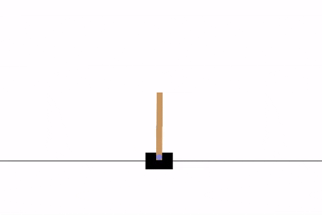
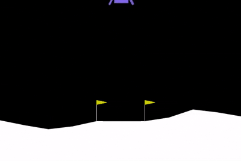

# Deep Q‑Learning Workbench (PyTorch)

A clean, modular Deep Q‑Learning (DQN) implementation in PyTorch with support for **Double DQN**, **Dueling networks**, and multiple backbones (MLP, 1D‑CNN, LSTM). The repo includes a training script, a replay script (to watch saved policies), video recording, and simple result tracking — designed to be easy to extend to new Gymnasium environments.

## 🎥 Output

<p align="center">
  
  &nbsp;&nbsp;&nbsp;
  
</p>

---

## ✨ Features

* **Algorithms**: DQN, Double DQN, Dueling architecture (toggle in config)
* **Backbones**: MLP, 1D‑CNN, LSTM (select via `MODEL_TYPE`)
* **Targets**: hard copy or **soft/Polyak** updates
* **Loss**: Huber (default) or MSE
* **Replay buffer**: uniform experience replay
* **Logging/Artifacts**: moving‑average score, reward plot, best checkpoint
* **Video**: optional training videos; replay videos on demand
* **Reproducibility**: global seed toggle (note: full determinism is environment‑dependent)

---

## 📦 Environment setup

Use the provided Conda file:

```bash
conda env create -f environment.yml
conda activate rl
```

> **Note:** If you don’t have a GPU, use the CPU‑only variant of the environment or remove the CUDA line from `environment.yml`.

---

## 🗂️ Project structure

```
Deep-Q-Learning-Workbench/
├── config.py            # Hyperparameters & switches (env, model, loss, target update, etc.)
├── dqn_agent.py         # DQN agent (policy/target nets, action select, optimize step)
├── networks.py          # MLP / CNN1D / LSTM (+ dueling variants)
├── replay_buffer.py     # Uniform replay buffer
├── utils.py             # Seeding, plotting, checkpoint & config save
├── main.py              # Training entrypoint
├── replay.py            # Load a saved model and replay episodes (optional video)
├── environment.yml      # Conda environment spec
└── results/             # Auto‑created run folders (checkpoints, plots, videos)
```

Each training run creates a timestamped folder under `results/`:

```
results/<ENV_NAME>_YYYYmmdd_HHMMSS/
├── best_model.pth
├── hyperparameters.txt
├── reward_plot.png
├── total_rewards.txt
└── videos/ (optional, if enabled)
```

---

## ⚙️ Configuration

All switches live in **`config.py`**. Common ones:

* **Environment**

  * `ENV_NAME`: `'CartPole-v1'` or `'LunarLander-v3'` (extend with any Gymnasium env)
  * `SEED`: random seed
* **Model**

  * `MODEL_TYPE`: `'MLP' | 'CNN1D' | 'LSTM'`
  * `dueling_network`: `True|False`
* **Algorithm**

  * `double_dqn`: `True|False`
  * `LOSS`: `'huber' | 'mse'`
  * `SOFT_UPDATE`: `True|False`; `TAU`: Polyak coefficient
  * `GAMMA`: discount factor
* **Optimization**

  * `LEARNING_RATE`, `BATCH_SIZE`, `REPLAY_BUFFER_SIZE`, `WARMUP_STEPS`
  * `TARGET_UPDATE_FREQ` (used if `SOFT_UPDATE=False`)
* **Exploration**

  * `EPSILON_START`, `EPSILON_END`, `EPSILON_DECAY`
* **Training**

  * `NUM_EPISODES`, `MAX_STEPS_PER_EPISODE`, `MOVING_AVG_WINDOW`, `REPORT_INTERVAL`
* **I/O**

  * `SAVE_MODEL`: save best checkpoint by moving‑average score
  * `RECORD_VIDEO`: record training videos every `VIDEO_RECORD_INTERVAL`

---

## 🚀 Train

1. Pick the environment and model in `config.py`.
2. Run training:

```bash
python main.py
```

Artifacts are written to `results/<ENV_NAME>_<timestamp>/`.

> Tip: enable/disable training video recording via `RECORD_VIDEO` in `config.py`.

---

## 🎬 Replay a saved model

Use **`replay.py`** to watch the policy or record MP4s.

**Option A — edit the constants at the top of `replay.py`:**

* Set `RESULTS_PATH` to a specific run folder, e.g. `results/LunarLander-v3_20250914_220000`
* Toggle `SAVE_VIDEO=True` to write MP4s to `replay_videos/` inside that run

```bash
python replay.py
```

**Option B — (if your version supports CLI flags)**

```bash
python replay.py \
  --checkpoint results/LunarLander-v3_20250914_220000/best_model.pth \
  --episodes 10 --epsilon 0.0 --record-dir replay_videos
```

> If you replay on a different machine (CPU vs GPU), loading still works thanks to map‑location logic.

---

## 🔍 Notes & tips

* **Box2D**: `LunarLander-v3` requires Box2D. If pip gives trouble, the Conda package `box2d-py` is included in the environment.
* **Video encoding**: Recording uses Gymnasium’s `RecordVideo`; if FFmpeg is missing, install `imageio-ffmpeg` (included in the env) or your system’s `ffmpeg`.
* **Determinism**: RL training is inherently stochastic. Seeding improves repeatability but slight differences are expected.
* **Extending to new envs**: switch `ENV_NAME`, adjust `n_states`/`n_actions` if using custom spaces, and you’re good to go.

---

## 🧪 Roadmap

* Prioritized Experience Replay
* NoisyNets or parameter‑space noise for exploration
* Frame stacking / sequence sampling for the LSTM path

---

## 🙌 Acknowledgements

* [Gymnasium](https://github.com/Farama-Foundation/Gymnasium)
* [PyTorch](https://pytorch.org/)


